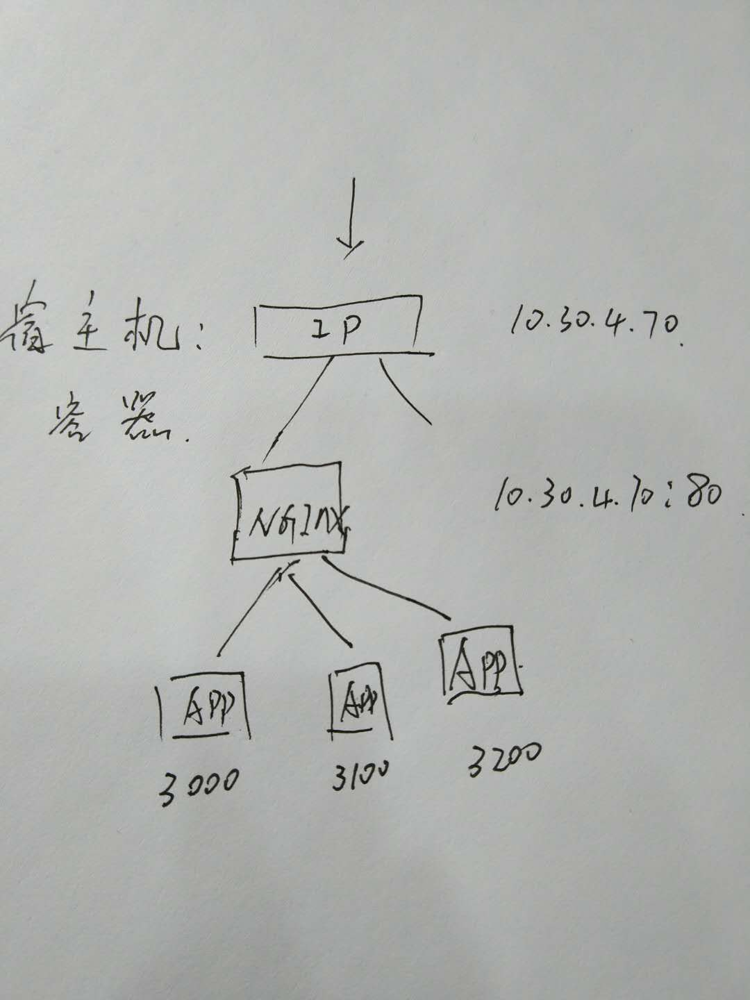

# 项目初衷
1. 构建Nodejs + Express 项目的Docker镜像
2. 测试Nginx反向代理到多个APP的配置

上图 说明：


# 前提条件
1. NodeJS
2. Docker

# 快速开始
```
cd App1 && docker build -t nodejs_app_1 .
docker run -p 3100:3100  -d --name nodejs_app_1 nodejs_app_1
```

访问 `http://localhost:3100`  OR `http://localhost:3200`

# 主要代码

```
FROM registry.cn-hangzhou.aliyuncs.com/zuowenbo/nodejs


# 安装pm2守护进程
RUN npm install pm2 -g -verbose --registry=https://registry.npm.taobao.org

# Create app directory
RUN mkdir -p /usr/src/app
WORKDIR /usr/src/app


# Install app dependencies
COPY package.json /usr/src/app/
RUN npm install -verbose --registry=https://registry.npm.taobao.org


# Bundle app source
COPY . /usr/src/app


# 端口
EXPOSE 3100


# 默认执行(可被运行时重写)
CMD ["pm2","start", "ecosystem.config.js","--no-daemon"]

# 构建命令
# docker build -t nodejs_app_1 .

# 运行命令
# docker run -p 3100:3100  -d --name nodejs_app_1 nodejs_app_1

```

# nginx 部分
1. 需要修改host文件，以mac为例 `sudo vim /etc/hosts` 做测试

# 遗留
目前测试的宿主机是一台。如果是多台并且docker是多个实例有待完善。